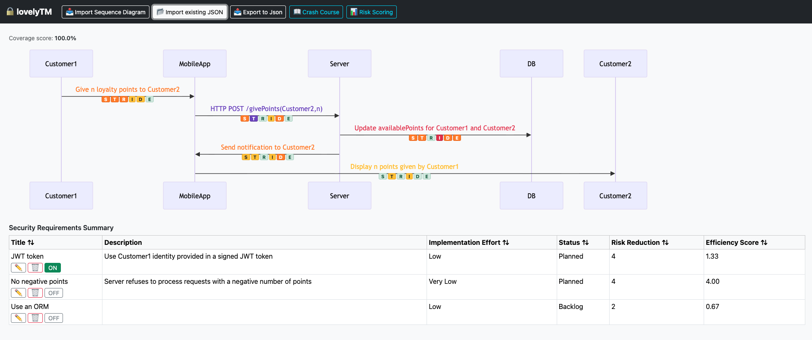

# lovelyTM

A lovely and lightweight threat modeling tool.

## CONCEPT

Hopefully this is not yet another threat modeling tool as the concept is built on **strong differentiators**:
* based on [Microsoft STRIDE](https://learn.microsoft.com/en-us/azure/security/develop/threat-modeling-tool-threats#stride-model), but **focusing first on business risks** to make it less verbose
* **visual heatmap** of the most sensitive areas
* help **produce a prioritized short-list of most important security requirements**, rather than a long inventory of threats 
* using regular [sequence diagrams](https://en.wikipedia.org/wiki/Sequence_diagram) to minimize the learning curve, but defining them as code to enable reusability and easy versioning
* browser-only code to avoid storing critical information in a backend/database, persistence achieved via importing/exporting human readable JSON files 

Instead of computing business risk as business impact * probability, probability is estimated as the opposite of attack difficulty. Risk tables are available by clicking on Risk Scoring.

All the details are available in the [specs file](SPECS.md), the source of truth used by Claude Code to generate this application.

## HOWTO

The recommended way:

0. Read the built-in Crash Course
1. Draw you diagram with Import Sequence Diagram, using the [Mermaid syntax](https://mermaid.js.org/syntax/sequenceDiagram.html). Or just copy-paste the content of [example1](examples/usecase1.md)
2. Document the Business Impact scenarios for all the STRIDE letters
3. Any STRIDE letter that has a question mark (?) underneath requires an attack scenario to compute the business risk
4. Document the Attack Scenario by providing a technical and a logistics difficulty
5. Observe the risk heatmap and decide to take action above a given threshold (e.g. High/red and Critical/purple)
6. Click on the corresponding STRIDE letter(s) and Create Security Requirement(s) on the attack scenario(s): 
  - any technical solution/process/documentation that would make the attack more difficult (and hence reduce the business risk). 
  - Provide the updated technical/logistics difficulty and an estimation of the implementation effort.
7. Any STRIDE letter that has an exclamation mark (!) underneath inherits the security requirement(s). Optional: provide the updated technical/logistics difficulty 
8. Observe the Security Requirements Summary table: you can simulate the visual impact of activating/desactivating a security requirement, but also sort them by risk reduction (the greater the better) or efficiency score (risk reduction vs implementation effort)
9. Save results by exporting to JSON

You just want to play with the tool? Import the existing JSON file `examples/usecase1.json`

## DEPLOYMENT

You can use direclty the [hosted version](https://lovelytm.appsecmatters.com): no need to worry about sensitive information, all the processing is handled direclty by the browser (no backend or database).

Or you can self-host this folder with the static web server of your choice.

## ROADMAP

Coming soon:
* Diff feature between an exported JSON file and a new sequence diagram: ask to update only the modified Interactions
* Reusing scenarios between different Interactions or STRIDE letters

## CONTRIBUTING

Either file in an issue or propose a pull request with modifications in `SPECS.md`.
(Pull requests changing code directly will be ignored.)

## ANY QUESTION ?

Contact lovelytm@appsecmatters.com
